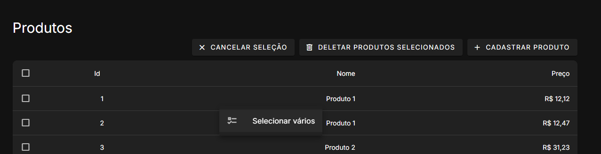

# Api Rest Django + Vue

Desafio feito seguindo as regras propostas:

1) Instale configure uma instancia Django no seu computador
   a. O banco de dados pode ser a ser escolha  
   b. Utilização de encapsulamento por Docker é bem-vinda e facilita o ambiente

2) Crie uma REST API utilizando APIView:  
   a. Precisará ter dois métodos um para recuperação outro para criação (GET,
   POST)    
   b. Opcionalmente pode se add um método delete

3) Crie um endpoint que consuma a API criada através dos templates  
   a. O front-end deve permitir listar e criar produtos a partir dessa(s) telas  
   b. O produto deve ter: nome, foto, descrição  
   c. O candidato poderá utilizar quaisquer tecnológias que preferir na construção  
   do front (JS nativo, jQuery, Vue3, React, etc...)  
   d. Utilização de bibliotecas populares como Bootstrap são bem vindas

# Como iniciar

### Docker ou docker engine recomendados para facilitar a execução

1. Clone o repositório
2. Entre na pasta do projeto
3. Execute o comando `docker-compose up`
4. Com sorte, o front estará disponível em `http://localhost:5173` e o backend em `http://localhost:8000`

# Features

* Criar produto
* Listar produtos
* Detalher produto
* Deletar produto
* Deletar multiplos produtos
* Paginação na tabela
* Queries customizadas para ordenação e filtro

## Imagens

